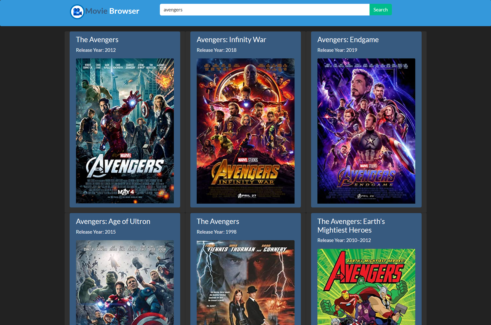
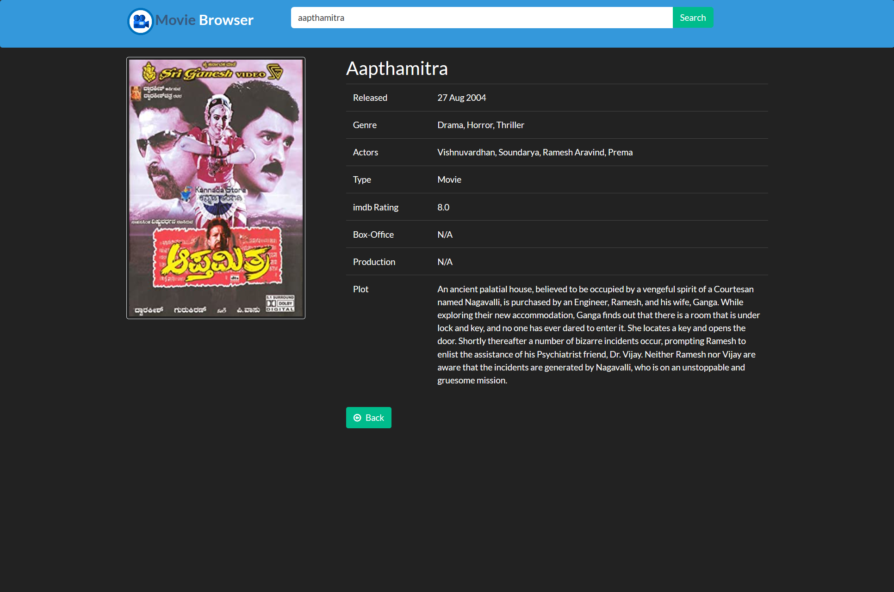

<!DOCTYPE html>
<html>
    <body>
        <h1>Movie Browser App</h1>
        <h3><a href="https://movie-browser27.web.app/home">MovieBrowserApp</a></h3>
        
        
        
Movie Browser App is progressive web app(PWA) built using angular. We can search movies and get more information about these movies.
            I have used the <b>The Open Movie Database(omdb)</b> api to get list and information of movies. Our App displays a list of 10 movies 
            which have the search keyword included in their name. Below is the image of the search and its results.
        

        
Main Dashboard

        
        

            On clicking on a particular movie we get a detailed information about the movie; As shown Below
        

        
Movie Details Dashboard

        
        

        
The Movie Browser app is well designed for even Mobile Views

        
Mobile View

        
        

        <h3>Getting Started</h3>

        <ul>
            <li>Install nodejs from the <a href="https://nodejs.org/en/">Official NodeJs Page</a></li>
            <li>Open the poject in terminal or command prompt</li>
            <li>Run <code>npm install</code> to install the necessary packages.</li>
            <li>Run <code>npm start</code> to start the server</li>
            <li>Once Compiled succesfully you will see the app running in <code> http://localhost:4200/</code></li>
        </ul>
        Omdb API 
        <ul>
            <li>Visit the Official Site of <a href="http://www.omdbapi.com/">omdb API</a></li>
            <li>Navigate to the <a href="http://www.omdbapi.com/apikey.aspx">API Key</a> section in the Website</li>
            <li>Select the Free Option and enter your Email to recieve a unique API Key</li>
            <li>Place your API Key value at the end of <code>http://www.omdbapi.com/?apikey=</code> in services/movies.service.ts</li>
        </ul>
        <h3>Progressive Web App</h3>

        A progressive web app (PWA) is a website that looks and behaves as if it is a mobile app.
         PWAs are built to take advantage of native mobile device features, without requiring the end user to visit an 
         app store, make a purchase and download software locally. Unlike traditional apps, progressive web apps are a 
         hybrid between regular web pages and mobile applications. 
         To convert an application to PWA :
         <ul>
             <li>Navigate to the project folder in cmd or terminal</li>
             <li>Install the angular cli. Refer <a href="https://angular.io/guide/setup-local">Official Angular Site</a></li>
             <li>Run <code>ng add @angular/pwa</code></li>
         </ul>
         <h3>Firebase</h3>

         It is used for Hosting the app. Install Firebase using npm. Refer <a href="https://www.npmjs.com/package/firebase">Install Firebase</a>
         
Run <code>firebase init</code> in project folder and proceed to <code>(public) dist/movie-browswer</code>

         <ul>
            <li><code>Config to single page app? index.html yes</code></li>
            <li>Run <code>ng build</code> to build the app and then run <code>firebase deploy</code> to deploy the app.</li>
         </ul>
    </body>
</html>
